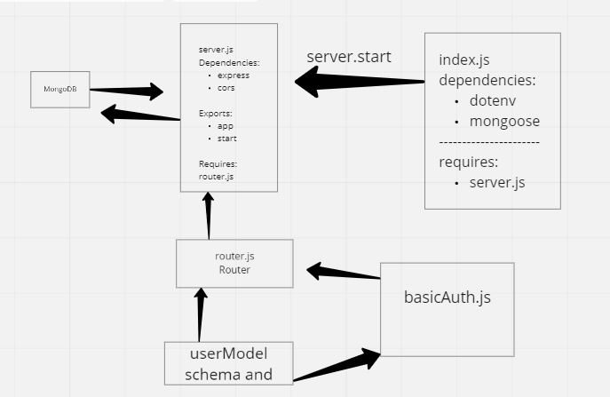

# basic-auth

**Description**

*Phase 1 Requirements Today, we begin the first of a 3-Phase build of an authentication system, written in Express. The following core requirements detail the functionality for this phase of the project.*

*As a user, I want to create a new account so that I may later login Using a tool such as httpie, postman, or a web form: Make a POST request to the/signup route with username and password Your server should support both JSON and FORM data as input On a successful account creation, return a 201 status with the user object in the body On any error, trigger your error handler with an appropriate error As a user, I want to login to my account so that I may access protected information Using a tool such as httpie, postman, or a web form: Make a POST request to the /signin route Send a basic authentication header with a properly encoded username and password combination On a successful account login, return a 200 status with the user object in the body On any error, trigger your error handler with the message “Invalid Login” Technical Requirements / Notes You have been supplied a “monolithic” express server in the starter-code folder which fulfills the above requirements. To complete the work for this phase, refactor the provided server using best practices, modularizing the code and providing tests, as follows:*

***Basic Server Extract the core server logic into 2 files: index.js (entry point) Connect to the database Require the ‘server’ and start it server.js service wiring Exports an express app/server and a start method Authentication Modules Keep your authentication related files in a folder called /auth so they are independent of the server itself***

## Links

**Heroku Link:** [https://basic-auth-amro.herokuapp.com/](https://basic-auth-amro.herokuapp.com/)

**Github Actions:** [https://github.com/amroalbarham/basic-auth/actions](https://github.com/amroalbarham/basic-auth/actions)

**Pull Request:** [https://github.com/amroalbarham/basic-auth/pull/1](https://github.com/amroalbarham/basic-auth/pull/1)

## UML

